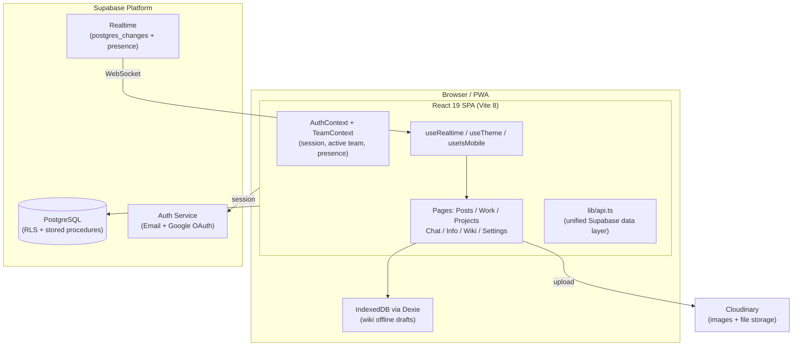

<div align="center">


# Syncbase

**One collaborative workspace for social content, task management, team chat, and shared knowledge.**

[](LICENSE)
[](https://react.dev)
[](https://www.typescriptlang.org)
[](https://supabase.com)
[](https://tailwindcss.com)
[](https://vite.dev)

[Live Demo](https://syncbase.spacesdrive.cc) · [Report a Bug](https://github.com/spacesdrive/syncbase/issues/new?labels=bug&template=bug_report.md) · [Request a Feature](https://github.com/spacesdrive/syncbase/issues/new?labels=enhancement&template=feature_request.md) · [Contributing](#contributing)

</div>

---

## The Problem

Modern teams are scattered across too many disconnected tools. Content drafts live in Google Docs, tasks pile up in Jira, social posts go through Buffer, conversations happen in Slack, and nobody can remember where the API keys are stored. Context gets lost. Work gets duplicated. Team members spend more time switching apps than shipping.

Syncbase collapses all of that into a single, real-time workspace. Your team plans social content, ships tasks, tracks projects, chats, and builds shared documentation without leaving one tab.

It is fully open-source, self-hostable, and installable as a PWA. Built on React 19, TypeScript, Tailwind CSS v4, and Supabase.

---

## Features

| Module | What it does |
|:---|:---|
| **Posts** | Draft, review, schedule, and track social content across LinkedIn, Instagram, X/Twitter, Facebook, Reddit, YouTube, and Threads. Attach images via Cloudinary. Collect emoji reactions and comments. Run a team review workflow from draft through approved to posted. |
| **Work** | Full task management with four views: Kanban board, sortable table, calendar, and Pods view (tasks grouped by assignee). Drag-and-drop reordering, multi-assignee support, priority levels (High/Medium/Low), role-based status transitions, inline comments, and reactions. |
| **Projects** | Group related tasks under named projects. Track each project with a goal checklist, progress indicator, status badges, and a dedicated task list. Link tasks directly to project goals. |
| **Chat** | Real-time team channel plus one-to-one direct messages. Edit and delete messages, react with emoji, attach images and files, see unread DM counts per member, and track online presence. |
| **Info Board** | Structured team knowledge store. Eight item types: text notes, API keys, numbers, AI prompts, Claude skills, photos, videos, and documents. Pin items to the top, react, reorder by drag-and-drop, and search across all entries. |
| **Wiki** | Full team wiki powered by BlockNote (block-based rich text). Create nested page trees, link pages with tracked backlinks, save pages to favorites, and recover unsaved work from automatic offline drafts via IndexedDB. Full-text search across all pages. |
| **Settings** | Profile management with avatar upload, team rename and logo upload, invite code regeneration and sharing, member role management (admin/member), and light/dark theme toggle with system-preference detection. |
| **Auth** | Email and password sign-up and login. Google OAuth. Auto-provisioned user profiles on first sign-in. Invite-code-based team joining. Support for multiple teams per account with instant switching. |

### Social platform coverage

| LinkedIn | Instagram | X / Twitter | Facebook | Reddit | YouTube | Threads |
|:---:|:---:|:---:|:---:|:---:|:---:|:---:|
| Yes | Yes | Yes | Yes | Yes | Yes | Yes |

---

## Screenshots

> Screenshots and a demo GIF will be added in the next release. To preview the application, follow the [Quick Start](#quick-start) guide and run it locally.

---

## Tech Stack

| Layer | Technology |
|:---|:---|
| Framework | React 19 and TypeScript 5.8 |
| Build tool | Vite 8 |
| Styling | Tailwind CSS v4 |
| UI primitives | Radix UI via the shadcn/ui pattern |
| Backend, auth, and real-time | Supabase (PostgreSQL, Realtime, Auth) |
| Rich text editor | BlockNote 0.51 |
| Drag and drop | dnd-kit |
| Forms | react-hook-form and Zod |
| File uploads | Cloudinary |
| Routing | React Router v7 |
| Offline storage | Dexie (IndexedDB wrapper) |
| Client state | Zustand |
| Charts | Recharts |
| Animation | Framer Motion |
| Notifications | Sonner |
| Icons | Lucide React |
| Date utilities | date-fns |
| PWA | Web App Manifest with service worker |

---

## Quick Start

Get Syncbase running locally in under two minutes.

### Prerequisites

- Node.js 20 or later
- A [Supabase](https://supabase.com) project (free tier is sufficient)
- A [Cloudinary](https://cloudinary.com) account (free tier is sufficient)
- A Google Cloud OAuth client ID (optional, only needed for Google sign-in)

### 1. Clone and install

```bash
git clone https://github.com/spacesdrive/syncbase.git
cd syncbase
npm install
```

### 2. Configure environment variables

```bash
cp .env.example .env
```

Open `.env` and fill in your values:

```env
VITE_SUPABASE_URL=https://your-project.supabase.co
VITE_SUPABASE_PUBLISHABLE_KEY=your_anon_key

VITE_CLOUDINARY_CLOUD_NAME=your_cloud_name
VITE_CLOUDINARY_UPLOAD_PRESET=your_unsigned_preset

VITE_GOOGLE_CLIENT_ID=your_google_client_id
```

**Where to find these values:**

- Supabase URL and anon key: Supabase dashboard, Project Settings, then API
- Cloudinary cloud name and preset: Cloudinary dashboard, then Account Details and Upload Presets
- Google Client ID: [Google Cloud Console](https://console.cloud.google.com), APIs and Services, then Credentials

### 3. Set up the Supabase database

Run the SQL migrations in your Supabase SQL editor. The schema creates these tables:

`profiles` `teams` `team_members` `posts` `post_images` `post_reactions` `comments` `tasks` `task_assignees` `task_comments` `task_reactions` `projects` `project_goals` `info_items` `info_reactions` `team_messages` `direct_messages` `message_reactions` `notifications` `activity_events` `wiki_pages` `wiki_backlinks` `wiki_favorites` `wiki_page_history`

The following stored procedures are required:

`create_post` `create_task` `create_project` `update_project` `set_task_assignees` `update_task_assignee_status` `reorder_tasks` `create_task_comment`

Enable **Row Level Security** on all tables and **Realtime** on: `posts`, `tasks`, `team_messages`, `direct_messages`, `notifications`, `task_comments`, and `wiki_pages`.

### 4. Start the dev server

```bash
npm run dev
```

Open [http://localhost:5173](http://localhost:5173). Sign up, create a team, and you are in.

---

## Architecture



**Data flow:**

1. `AuthContext` resolves the Supabase session on mount and auto-provisions a `profiles` row for new users.
2. `TeamContext` reads the active team from `localStorage`, loads team members, and opens a Supabase Realtime presence channel to track online status.
3. All data operations go through `lib/api.ts`, which wraps Supabase queries and stored procedure calls with typed helpers.
4. Pages subscribe to live updates using the `useRealtime` hook, which channels `postgres_changes` events back through the same data helpers, keeping the UI in sync across all open sessions without polling.
5. The Wiki module writes unsaved drafts to IndexedDB via Dexie so edits survive page refreshes and network interruptions.

---

## Project Structure

```
syncbase/
├── public/                     # PWA manifest, favicon set, app icons
│   └── manifest.json
├── src/
│   ├── App.tsx                 # Router, route guards, error boundary
│   ├── main.tsx                # React root, global providers
│   ├── index.css               # Global styles and Tailwind imports
│   ├── styles/
│   │   └── theme.css           # CSS custom properties for light and dark themes
│   ├── lib/
│   │   ├── api.ts              # All Supabase API calls (teams, posts, tasks, chat, wiki)
│   │   ├── supabase.ts         # Supabase client initialisation
│   │   ├── cloudinary.ts       # Image and file upload helpers
│   │   ├── constants.ts        # Platforms, statuses, priorities, info types
│   │   ├── taskStatusRules.ts  # Role-based task status transition rules
│   │   └── utils.ts            # cn() and shared utilities
│   ├── contexts/
│   │   ├── AuthContext.tsx     # Auth state, session management, profile provisioning
│   │   └── TeamContext.tsx     # Active team, members, presence tracking, team switching
│   ├── hooks/
│   │   ├── useRealtime.ts      # Supabase Realtime subscription wrapper
│   │   ├── useTheme.ts         # Dark and light mode with localStorage persistence
│   │   └── useIsMobile.ts      # Responsive breakpoint hook
│   ├── components/
│   │   ├── ui/                 # shadcn/Radix UI primitives and custom app components
│   │   ├── layout/             # Layout shell, Sidebar, TopBar
│   │   ├── aceternity/         # Aurora background and spotlight effects
│   │   └── icons/              # Platform SVG icons (LinkedIn, Instagram, etc.)
│   ├── features/
│   │   └── wiki/
│   │       ├── components/     # WikiHome, WikiSidebar, WikiPageView, WikiEditor, WikiBacklinks
│   │       ├── hooks/          # useWikiPages (page tree, search, CRUD)
│   │       ├── services/       # offlineService (Dexie), searchService
│   │       ├── stores/         # Zustand wiki store
│   │       └── types/          # WikiPage, WikiBacklink, WikiDraft types
│   └── pages/
│       ├── auth/               # Login, Signup
│       ├── team/               # TeamSetup (create or join)
│       ├── posts/              # Posts list, PostCard, NewPostModal
│       ├── work/               # Work hub, Kanban, Table, Calendar, Pods, TaskCard
│       ├── projects/           # Project list, ProjectDetail, ProjectGoals
│       ├── chat/               # Team channel and direct messages
│       ├── info/               # Info Board
│       ├── wiki/               # Wiki page router
│       └── settings/           # Profile, account, appearance, notifications, members
├── .env.example
├── vite.config.ts
├── tsconfig.app.json
└── package.json
```

---

## Database Schema

The key relationships at a glance:

| Table | Purpose |
|:---|:---|
| `profiles` | One row per Supabase auth user. Stores name, avatar, email. |
| `teams` | Workspace entity. Has a unique invite code for joining. |
| `team_members` | Join table between profiles and teams. Holds role (admin/member). |
| `posts` | Social content drafts. References team, author, platforms array, and scheduled time. |
| `post_images` | One-to-many image URLs per post (via Cloudinary). |
| `tasks` | Work items. Linked to team, project, primary assignee, and sort order for drag-and-drop. |
| `task_assignees` | Multi-assignee support per task with per-assignee status tracking. |
| `task_comments` | Threaded comments on tasks. |
| `projects` | Project containers. Each belongs to a team. |
| `project_goals` | Checklist goals under a project with progress tracking. |
| `info_items` | Info board entries. Typed (text/api_key/number/prompt/etc.), pinnable, orderable. |
| `team_messages` | Team channel messages. Supports attachments and reactions. |
| `direct_messages` | One-to-one messages between team members. Has read/unread tracking. |
| `message_reactions` | Emoji reactions on team or DM messages. |
| `notifications` | In-app notification feed per user with read/unread state. |
| `wiki_pages` | Wiki pages with nested parent/child relationships, BlockNote JSON content, and sort order. |
| `wiki_backlinks` | Tracks which wiki pages link to which other wiki pages. |
| `wiki_favorites` | Per-user wiki page bookmarks. |
| `wiki_page_history` | Version history snapshots saved on each wiki page publish. |
| `activity_events` | Audit log of team actions (task created, completed, etc.). |

All tables have Row Level Security enabled. Users can only read and write data belonging to their own teams.

---

## Available Scripts

```bash
npm run dev       # Start development server at http://localhost:5173
npm run build     # Production build to dist/
npm run preview   # Serve the production build locally
npm run lint      # Run ESLint across the source tree
```

---

## Deployment

Syncbase is a static single-page application. Deploy the `dist/` folder to any host that can serve static files with a catch-all redirect to `index.html`.

### Vercel (recommended)

```bash
npm install -g vercel
vercel --prod
```

Set the five environment variables in the Vercel dashboard under Project, then Settings, then Environment Variables.

### Netlify

```bash
npm run build
```

Drag and drop the `dist/` folder at [app.netlify.com/drop](https://app.netlify.com/drop), or connect the GitHub repository with build command `npm run build` and publish directory `dist`. Add a `_redirects` file to `public/`:

```
/* /index.html 200
```

### Self-hosted (Nginx)

```nginx
server {
    listen 80;
    server_name your-domain.com;
    root /var/www/syncbase/dist;
    index index.html;

    location / {
        try_files $uri $uri/ /index.html;
    }
}
```

> Because Syncbase is a client-side SPA, every server route must return `index.html`. The `try_files` directive above handles this for Nginx. Without it, direct links and page refreshes will return 404.

---

## Environment Variables Reference

| Variable | Required | Description |
|:---|:---:|:---|
| `VITE_SUPABASE_URL` | Yes | Supabase project URL (e.g. `https://xxxx.supabase.co`) |
| `VITE_SUPABASE_PUBLISHABLE_KEY` | Yes | Supabase anon / publishable key |
| `VITE_CLOUDINARY_CLOUD_NAME` | Yes | Cloudinary cloud name for image and file uploads |
| `VITE_CLOUDINARY_UPLOAD_PRESET` | Yes | Unsigned Cloudinary upload preset name |
| `VITE_GOOGLE_CLIENT_ID` | No | Google OAuth client ID (enables Google sign-in button) |

---

## Troubleshooting

<details>
<summary><strong>Blank page after login with "Missing Supabase env vars" in the console</strong></summary>

Your `.env` file is either missing or has incorrect variable names. Check that the file is at the project root (same level as `package.json`) and that you restarted the dev server after editing it. Vite only exposes environment variables that start with `VITE_`.

</details>

<details>
<summary><strong>Stuck on the TeamSetup screen after logging in</strong></summary>

The signed-in user has no team membership. Either create a new team or join one with an invite code. If you are testing with the same account repeatedly, check that the `team_members` row was not accidentally deleted in the Supabase table editor.

</details>

<details>
<summary><strong>Image uploads fail silently</strong></summary>

Check that `VITE_CLOUDINARY_UPLOAD_PRESET` is an **unsigned** preset. In the Cloudinary dashboard: Settings, then Upload, then Upload Presets. The preset mode must be set to "Unsigned". Signed presets require a server-side signature and will not work from a browser.

</details>

<details>
<summary><strong>Real-time updates not arriving</strong></summary>

Supabase Realtime must be enabled per table. In the Supabase dashboard: Database, then Replication. Enable the following tables: `posts`, `tasks`, `team_messages`, `direct_messages`, `notifications`, `task_comments`, and `wiki_pages`.

</details>

<details>
<summary><strong>Google OAuth redirects to the wrong URL after sign-in</strong></summary>

In the Google Cloud Console under OAuth 2.0 Client credentials, add your full origin (e.g. `http://localhost:5173` for local development or `https://your-domain.com` for production) to both **Authorised JavaScript origins** and **Authorised redirect URIs**. Then add the same URL in Supabase under Authentication, then URL Configuration, then Redirect URLs.

</details>

<details>
<summary><strong>Wiki editor does not save changes</strong></summary>

Ensure the `wiki_pages` table has Realtime enabled and that your Supabase RLS policies allow the authenticated user to update rows in that table. Check the browser console for any 403 errors from Supabase.

</details>

---

## Roadmap

- [ ] Email notifications for task assignments and @mentions
- [ ] Post analytics dashboard (reach, engagement per platform)
- [ ] Calendar export compatible with Google Calendar and ICS
- [ ] Granular notification preferences per channel and event type
- [ ] Mobile application (React Native)
- [ ] Webhooks for external integrations (Zapier, Make)
- [ ] AI writing assistant for post caption drafting
- [ ] Public shareable wiki pages

Have an idea? [Open a feature request](https://github.com/spacesdrive/syncbase/issues/new?labels=enhancement&template=feature_request.md).

---

## Contributing

Contributions are welcome: bug fixes, new features, documentation improvements, and design refinements. Here is how to get started.

```bash
# Fork the repo on GitHub, then clone your fork
git clone https://github.com/YOUR_USERNAME/syncbase.git
cd syncbase

# Install dependencies
npm install

# Create a feature branch
git checkout -b feat/your-feature-name

# Start the dev server
npm run dev

# Lint before committing
npm run lint
```

1. **Fork** the repository and clone your fork locally.
2. **Create a branch** named `feat/your-feature` or `fix/your-bug`.
3. **Make your changes** and commit with a clear message following [Conventional Commits](https://www.conventionalcommits.org).
4. **Push** your branch and open a Pull Request against `main`.

For larger changes, please open an issue first to discuss the approach before investing significant time.

Browse issues labelled [`good first issue`](https://github.com/spacesdrive/syncbase/labels/good%20first%20issue) if you are new to the codebase.

---

## License

Distributed under the **MIT License**. See [`LICENSE`](LICENSE) for the full text.

You are free to use, modify, and distribute Syncbase in personal and commercial projects. Attribution is appreciated but not required.

---

## Acknowledgements

Syncbase is built on the shoulders of excellent open-source work:

- [Supabase](https://supabase.com) - backend, authentication, and real-time infrastructure
- [Radix UI](https://www.radix-ui.com) - accessible, unstyled UI primitives
- [shadcn/ui](https://ui.shadcn.com) - component patterns and composition model
- [Tailwind CSS](https://tailwindcss.com) - utility-first styling
- [BlockNote](https://www.blocknotejs.org) - block-based rich text editor
- [dnd-kit](https://dndkit.com) - drag-and-drop toolkit
- [Framer Motion](https://www.framer.com/motion/) - animation primitives
- [Cloudinary](https://cloudinary.com) - media management and delivery
- [Lucide](https://lucide.dev) - icon set
- [Dexie](https://dexie.org) - IndexedDB wrapper for offline storage
- [Zustand](https://zustand.docs.pmnd.rs) - lightweight client state management

---

<div align="center">

**If Syncbase saves your team time, a star on GitHub helps others discover it.**

[](https://github.com/spacesdrive/syncbase/stargazers)

</div>
